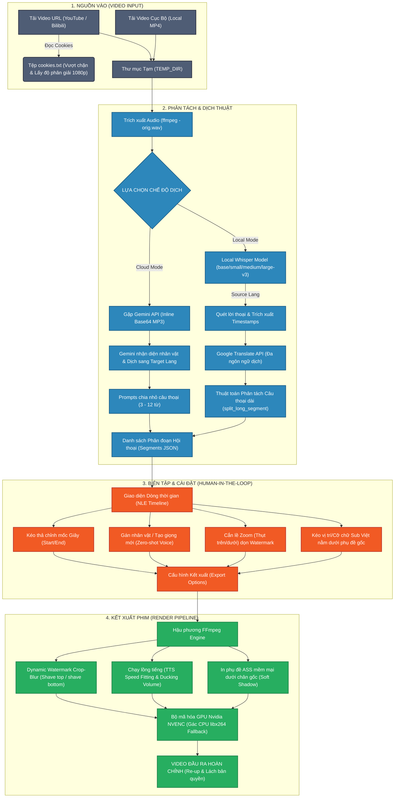

# Sơ đồ Quy Trình (Workflow Diagram) - V-reDub Studio

Dưới đây là sơ đồ chi tiết về luồng xử lý video, âm thanh, dịch thuật và lách bản quyền nghệ thuật trong hệ thống V-reDub Studio từ tệp tin gốc cho đến video đầu ra cuối cùng.

## Sơ đồ luồng xử lý (Mermaid Diagram)

## Chi tiết các bước hoạt động trong Workflow

1. **Bước 1 (Input):** Video được tiếp nhận từ URL hoặc ổ đĩa. Trình tải `yt-dlp` tự dò tìm `cookies.txt` tại gốc để vượt qua mã hóa, xác minh độ tuổi của YouTube hoặc giữ độ phân giải tối ưu của Bilibili.
2. **Bước 2 (Phân tách & dịch thuật):** Audio gốc được giải nén.
   * **Gemini (Cloud):** Nén MP3 24kbps cực nhẹ truyền trực tiếp inline giúp trả về phân vai thoại xúc cảm và dịch nghĩa.
   * **Whisper (Local):** Gọi nhận diện chính xác theo ngôn ngữ gốc rồi tự động tính toán dùng chia câu đều đặn qua code Python.
3. **Bước 3 (Biên tập):** Studio kết xuất JSON tạm để vẽ đồ họa Timeline, cho phép biên tập viên điều chỉnh căn lề watermark bằng cách di chuyển vùng cắt hoặc thay đổi cỡ chữ phụ đề Việt hiển thị phía dưới một cách an toàn.
4. **Bước 4 (Kết xuất):** FFmpeg tổ hợp: cắt & bù mờ dải viền watermark, lồng tiếng ép vừa cung thời gian thoại của nhân vật, dính phụ đề Ass nền mờ rồi render cực nhanh bằng CUDA/NVENC.
